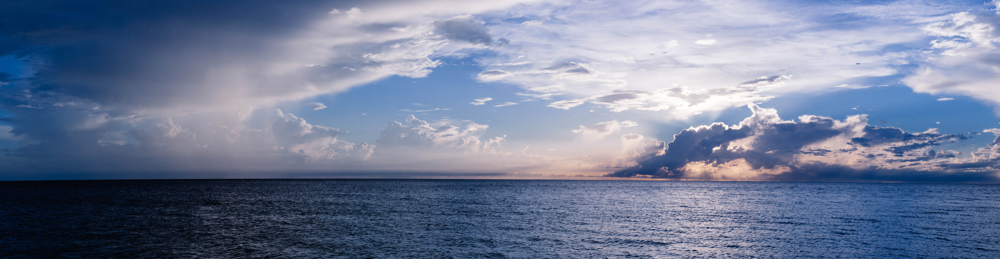
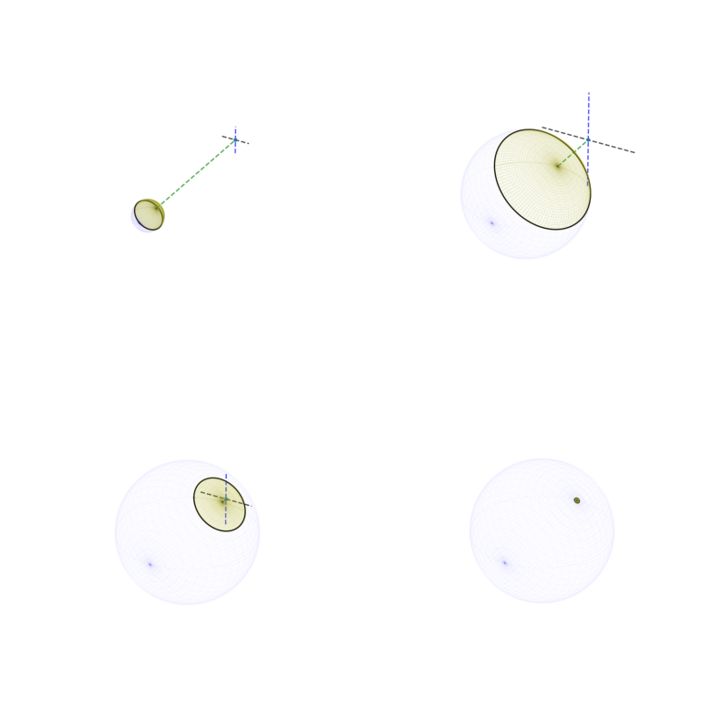

# PLANET RULER 🌍📏

*Measure planetary radii from horizon photographs using computer vision and geometry*

[](https://www.gnu.org/licenses/agpl-3.0)
[](https://www.python.org/downloads/)

> **🎯 Quick Demo**: Got a horizon photo? Drop it into our [interactive notebook](notebooks/limb_demo.ipynb) and measure your planet!



## 🚀 Quick Start

```bash
git clone https://github.com/bogsdarking/planet_ruler.git
cd planet_ruler
pip install -e .
```

```python
import planet_ruler as pr

# Load your horizon photo
obs = pr.LimbObservation("horizon_photo.jpg")
obs.detect_limb()           # AI-powered horizon detection
obs.fit_limb()             # Optimize planetary parameters
print(f"Planet radius: {obs.radius_km:.0f} km")
```

## 📖 What Does This Do?

Ever wondered how big the planet you're standing on is? **Planet Ruler** uses the subtle curvature visible in horizon photographs to estimate planetary radii with scientifically meaningful accuracy.

### The Science
Planets are round, but this isn't obvious from ground level. However, the higher you go, the more the horizon curves away from you. By analyzing this curvature in photographs and accounting for camera geometry, we can reverse-engineer the size of the world beneath your feet.



*As altitude increases, the horizon's curvature becomes more apparent and extends further into the distance.*

### Real Results from Demo Examples
Based on actual measurements with full convergence:

- 🌍 **Earth from ISS**: Estimated 5,377 km (true: 6,371 km) - *15.6% error*
- 🪐 **Saturn from Cassini**: Estimated 69,779 km (true: 58,232 km) - *19.8% error*  
- ❄️ **Pluto from New Horizons**: Estimated 1,448 km (true: 1,188 km) - *21.9% error*

*Results demonstrate proof-of-concept feasibility with ~20% typical accuracy. Performance depends on image quality, horizon clarity, altitude, and camera parameter knowledge.*

## 🎯 Key Features

- 🤖 **Automatic horizon detection** using Segment Anything AI
- 📐 **Full camera model optimization** (focal length, orientation, distortion)
- 🌍 **Multi-planetary support** with example configurations
- 📊 **Uncertainty quantification** using differential evolution
- 🎨 **Rich visualizations** including 3D planet views
- 📓 **Interactive tutorials** via Jupyter notebooks

## 🛠️ Installation

**From source (current method):**
```bash
git clone https://github.com/bogsdarking/planet_ruler.git
cd planet_ruler
pip install -e .
```

**Coming soon:**
```bash
# PyPI release planned
pip install planet-ruler

# Conda-forge package planned  
conda install -c conda-forge planet-ruler
```

## 🎮 Try It Now

**Option 1: Use our examples**
```python
from planet_ruler.demo import make_dropdown, load_demo_parameters
demo = make_dropdown()  # Choose Earth, Saturn, or Pluto
```

**Option 2: Your own photo**
```python
obs = pr.LimbObservation("your_photo.jpg", camera_config="config/your_camera.yaml")
```

## 🧠 How It Works

1. **📸 Load Image**: Import your horizon photograph
2. **🔍 Detect Horizon**: AI finds the limb/horizon line automatically  
3. **📐 Model Geometry**: Account for camera parameters and viewing angle
4. **⚡ Optimize**: Fit theoretical horizon curves to observed data using differential evolution
5. **🎯 Extract Radius**: Get planetary radius with uncertainty estimates

## 📚 Documentation & Examples

- 🎓 **[Complete Tutorial](notebooks/limb_demo.ipynb)** - Interactive Jupyter notebook walkthrough
- 📊 **[Example Results](demo/)** - Real measurements from space missions  
- 🔧 **[Camera Setup Guide](config/)** - Configure for your hardware
- 📖 **API Documentation** - Detailed function reference

## 🎯 Use Cases

- **Educational demonstrations** of planetary geometry
- **Proof-of-concept** for limb-fitting techniques
- **Computer vision** and optimization algorithm examples
- **Scientific photography** analysis

*Note: This is primarily an educational and demonstration tool. For precision planetary measurements, use established geodetic methods.*

## ⚠️ Limitations & Considerations

- **~20% typical accuracy** - suitable for educational/demonstration purposes
- **Requires clear horizon** - atmospheric effects and obstructions impact results
- **Camera knowledge needed** - rough camera specifications improve performance significantly
- **Single-image limitation** - stereoscopic or multi-image methods would be more robust
- **Optimization challenges** - complex parameter space can lead to local minima

## 🤝 Contributing

We welcome contributions! Here's how to get started:

- 🐛 **Found a bug?** Open an [issue](https://github.com/bogsdarking/planet_ruler/issues)
- 💡 **Have an idea?** Start a [discussion](https://github.com/bogsdarking/planet_ruler/discussions)  
- 📖 **Improve docs**: Documentation PRs are especially welcome
- 🔬 **Add examples**: Share your successful measurements
- ⚡ **Optimize code**: Help improve convergence and performance

See [CONTRIBUTING.md](CONTRIBUTING.md) for detailed guidelines.

## 📄 License

GNU Affero General Public License v3.0 - see [LICENSE](LICENSE) for details.

## 🙏 Acknowledgments

Built with modern scientific Python and powered by:
- [Segment Anything](https://segment-anything.com/) for horizon detection
- [SciPy](https://scipy.org/) for optimization
- [NumPy](https://numpy.org/) for numerical computing
- [Matplotlib](https://matplotlib.org/) for visualization

## 🔗 References

- [Horizon geometry (Wikipedia)](https://en.wikipedia.org/wiki/Horizon)
- [Camera calibration fundamentals](https://courses.cs.washington.edu/courses/cse455/09wi/Lects/lect5.pdf)
- [Earth curvature visibility analysis](https://earthscience.stackexchange.com/questions/7283/)
- [Camera resectioning theory](https://en.wikipedia.org/wiki/Camera_resectioning)
- [Intrinsic camera parameters](https://ksimek.github.io/2013/08/13/intrinsic/)

---
*"The horizon is just the limit of our sight, not the limit of our understanding."*
