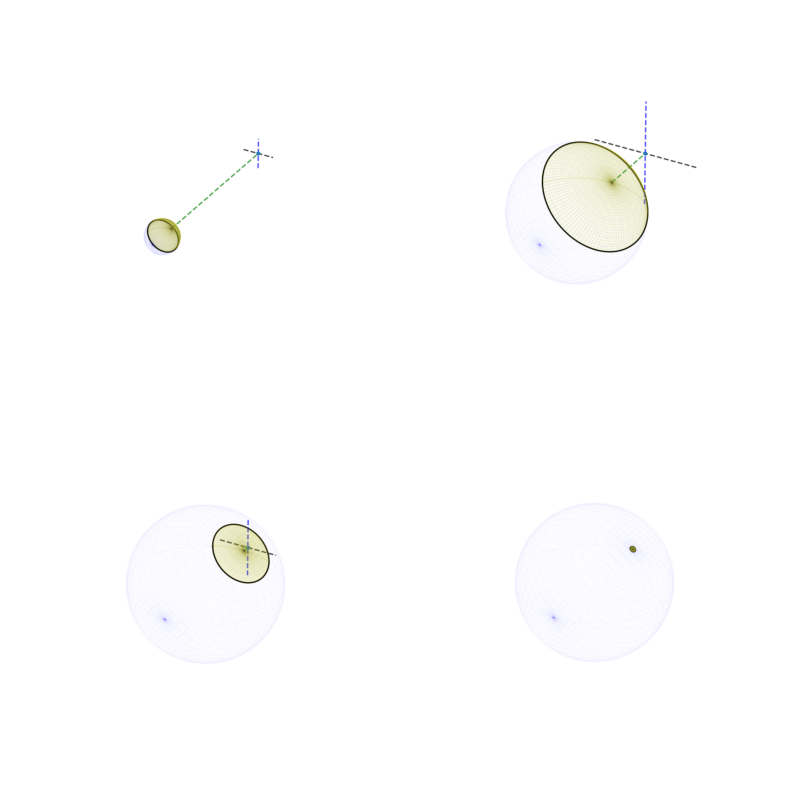
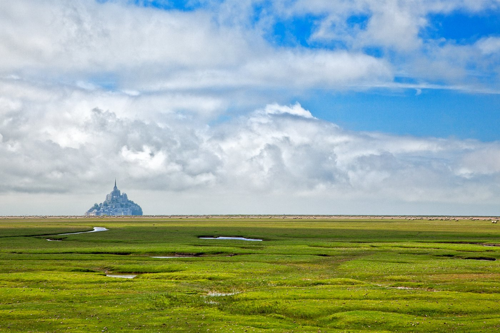
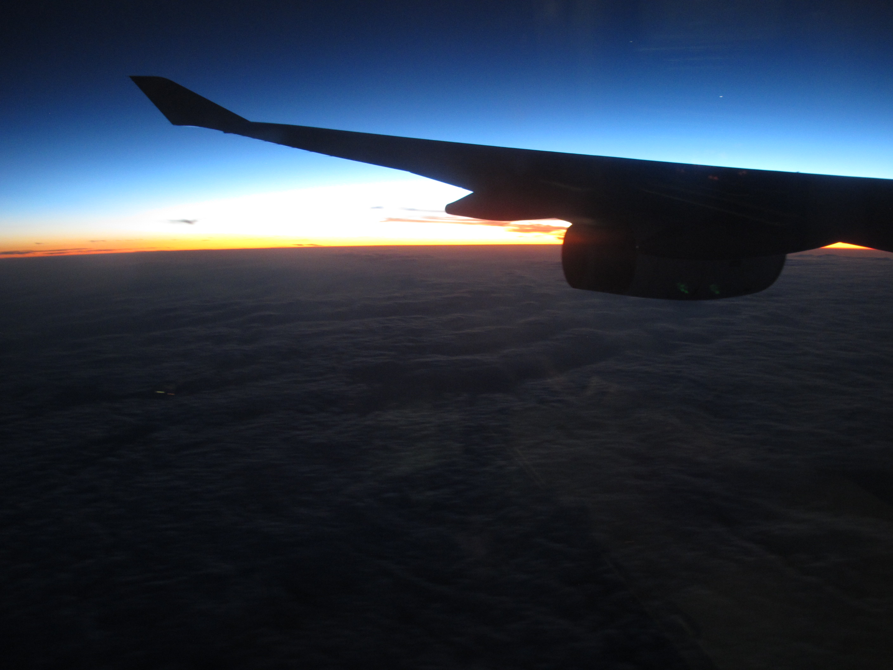

# PLANET RULER

**Measure planetary radii with nothing but a camera and science!**

[](https://pypi.org/project/planet-ruler/)
[](https://bogsdarking.github.io/planet_ruler/)
[](https://github.com/bogsdarking/planet_ruler/actions/workflows/ci.yml)
[](https://codecov.io/gh/bogsdarking/planet_ruler)
[](https://opensource.org/licenses/Apache-2.0)
[](https://github.com/bogsdarking/planet_ruler)

<div align="center">

**Got a horizon photo? Measure your planet in 3 lines of code!**

</div>

```python
import planet_ruler as pr
obs = pr.LimbObservation("horizon_photo.jpg", "config/camera.yaml")
obs.detect_limb().fit_arc()  # Planet radius: 6,234 km
```

<div align="center">

[Try Interactive Demo](notebooks/limb_demo.ipynb) • [Documentation](https://bogsdarking.github.io/planet_ruler/) • [Discussions](https://github.com/bogsdarking/planet_ruler/discussions)

</div>

---

<!--  -->

<div align="center">
<table>
<tr>
<td align="center" width="33%">

<br><b>Ground Level</b><br>
<em>~100 ft</em><br>
Horizon appears flat
</td>
<td align="center" width="33%">

<br><b>Commerical Aircraft</b><br>
<em>~35,000 ft</em><br>
Perceptible curvature
</td>
<td align="center" width="33%">

<br><b>International Space Station</b><br>
<em>~250 miles</em><br>
Dramatic spherical curvature
</td>
</tr>
</table>
</div>

<!-- <p style="text-align:right;">*From left to right: How horizon curvature changes with altitude, revealing the planetary radius beneath*</p> -->

<!-- *From left to right: How horizon curvature changes with altitude, revealing the planetary radius beneath* -->

## Quick Start

### Installation

**From PyPI (recommended):**
```bash
pip install planet-ruler
```

The package name is `planet-ruler` (with hyphen), but you import it with an underscore:
```python
import planet_ruler as pr  # Import uses underscore
```

**Optional dependencies:**

For ML segmentation:
```bash
pip install planet-ruler[ml]
```

For Jupyter notebooks:
```bash
pip install planet-ruler[jupyter]
```

For everything:
```bash
pip install planet-ruler[all]
```

**From source (development):**
```bash
git clone https://github.com/bogsdarking/planet_ruler.git
cd planet_ruler
pip install -e .
```

After installation, the command-line tool is available:
```bash
planet-ruler --help
```

### Python API
```python
import planet_ruler as pr

# Basic analysis
obs = pr.LimbObservation("photo.jpg", "camera_config.yaml")

# Choose detection method:
obs.detect_limb(detection_method='manual')          # Interactive GUI (default)
# obs.detect_limb(detection_method='gradient-break')  # Simple gradient-based detection
# obs.detect_limb(detection_method='gradient-field')  # Gradient flow analysis
# obs.detect_limb(detection_method='segmentation')    # AI-powered (requires PyTorch)

# OR skip detection and fit directly to image gradients:
# obs.fit_gradient(resolution_stages='auto')  # Gradient-field optimization

obs.fit_arc()      # Fit to detected limb points
obs.plot()         # Visualize results

# Access results with uncertainty
print(f"Radius: {obs.best_parameters['r']/1000:.0f} ± {obs.radius_uncertainty:.0f} km")
```

### Command Line
```bash
# Measure planetary radius using existing config file
planet-ruler measure photo.jpg --camera-config camera_config.yaml

# Auto-generate config from image EXIF data (requires altitude)
planet-ruler measure photo.jpg --auto-config --altitude 10668

# Auto-config with specific planet (affects initial radius guess)
planet-ruler measure photo.jpg --auto-config --altitude 10668 --planet mars

# Choose detection method (manual, gradient-break, gradient-field, or segmentation)
planet-ruler measure photo.jpg --auto-config --altitude 10668 --detection-method gradient-field

# Try built-in examples
planet-ruler demo --planet earth
```

## The Science Behind It

**The Problem**: How big is your planet?

**The Solution**: Depending on your altitude, planetary curvature becomes visible in the horizon. By measuring this curvature and accounting for your camera, we can reverse-engineer the planet's size.

<details>
<summary><strong>How It Works (Click to expand)</strong></summary>

1. **Capture**: Photograph showing horizon/limb from altitude
2. **Detect**: Choose your detection method:
   - **Manual**: Interactive GUI for precise point selection (default, no dependencies)
   - **Gradient-field**: Automated detection using gradient flow analysis
   - **Segmentation**: AI-powered detection (requires PyTorch + Segment Anything)
3. **Measure**: Extract curvature from the detected horizon
4. **Model**: Account for camera optics, altitude, and viewing geometry  
5. **Optimize**: Fit theoretical curves to observations using multi-resolution optimization
6. **Uncertainty**: Quantify measurement precision using population spread, Hessian approximation, or profile likelihood

**Mathematical Foundation**:
- Spherical geometry and horizon distance calculations
- Camera intrinsic/extrinsic parameter modeling
- Gradient-field analysis with directional blur and flux integration
- Multi-resolution optimization with coarse-to-fine refinement
- Non-linear optimization with robust error handling

</details>

## Why This Works

**A fundamental question**: At what altitude does Earth's curvature become detectable in a photograph?

**The surprising answer**: With modern phone cameras, curvature is detectable from **essentially ground level** (1-3 meters altitude).

The geometric signal—the vertical "sag" of the horizon arc across your image—exceeds one pixel even at remarkably low altitudes:

- **10 m altitude**: ~4 pixels of curvature (detectable)
- **100 m altitude**: ~12 pixels of curvature (easily measurable)
- **10 km altitude** (airplane): ~115 pixels of curvature (excellent signal)
- **100 km altitude** (space): ~360 pixels of curvature (hemisphere-scale)

Modern high-resolution sensors (4000+ pixels wide) can resolve these tiny angular deviations. The limiting factors aren't geometric visibility but rather:

- Atmospheric refraction and haze
- Optical quality (lens aberrations)  
- Scene complexity (buildings, trees obscuring horizon)
- Measurement precision in the fitting algorithm

This means horizon-based radius measurement is fundamentally sound across the entire altitude range from ground level to orbit. The method gets *easier* at higher altitudes (cleaner images, larger signal), but it *works* even from remarkably low vantage points.

**See the math**: [Minimum Detectable Altitude](docs/minimum_detectable_altitude.rst) | **Try it yourself**: [Interactive Notebook](notebooks/minimum_altitude_demo.ipynb)

## Real Results

**Validated on actual space mission data:**

| **Planet** | **Source** | **Estimated** | **True Value** | **Error** |
|------------|------------|---------------|----------------|-----------|
| **Earth** | ISS Photo | 5,516 km | 6,371 km | **13.4%** |
| **Saturn** | Cassini | 65,402 km | 58,232 km | **12.3%** |
| **Pluto** | New Horizons | 1,432 km | 1,188 km | **20.6%** |


## Key Features

<table>
<tr>
<td width="50%">

**Automatic Camera Detection**
- Auto-extract camera parameters from EXIF data
- Supports phones, DSLRs, mirrorless, point-and-shoot
- No manual camera configuration needed

**Flexible Detection & Fitting Methods**
- **Manual**: Interactive GUI with precision controls (default)
- **Gradient-field**: Automated detection via directional blur and flux analysis
- **Sagitta**: Fast radius estimate from horizon arc-height (new in 2.0)
- **Staged fitting**: Chain methods (e.g. sagitta → arc) for speed + accuracy
- **AI Segmentation**: Deep learning-powered (optional)

**Advanced Camera Models**
- Camera parameter optimization
- Multi-camera phone support (wide/main/tele inferred from EXIF)
- Interactive cropping tool (`TkImageCropper`) with auto-scaled parameters
- Flexible parameter limit presets (`tight` / `balanced` / `loose`)

**Multi-Planetary Support**
- Earth, Saturn, Pluto examples included
- Extensible to any spherical body

</td>
<td width="50%">

**Scientific Rigor**
- Multi-resolution optimization with coarse-to-fine refinement
- Advanced uncertainty estimation (population spread, Hessian, profile likelihood)
- Mathematical validation with property tests

**Live Progress Dashboard**
- Real-time optimization monitoring
- Adaptive refresh rate (fast during descent, slow at convergence)
- Configurable warnings, hints, and output display

**Rich Visualizations**
- Interactive plots
- 3D planetary geometry views

**Multiple Interfaces**
- Python API for scripting
- Command-line tool for automation
- Jupyter notebooks for exploration

**Works with Any Camera**
- iPhones, Android phones, DSLRs, mirrorless
- Automatic sensor size detection
- Intelligent parameter estimation

</td>
</tr>
</table>

## Installation & Setup

### Requirements
- **Python 3.10+**
- **RAM**: 4GB+ recommended (for AI models)
- **Storage**: ~2GB for full installation with models

### Install Options

<details>
<summary><strong>Quick Start (Recommended)</strong></summary>

```bash
# Clone and install in one go
git clone https://github.com/bogsdarking/planet_ruler.git
cd planet_ruler
python -m pip install -e .

# Verify installation
planet-ruler --help
python -c "import planet_ruler; print('Ready to measure planets!')"
```
</details>

<details>
<summary><strong>Minimal Install (Core features only)</strong></summary>

```bash
git clone https://github.com/bogsdarking/planet_ruler.git
cd planet_ruler

# Install without heavy AI dependencies
python -m pip install -e . --no-deps
python -m pip install numpy scipy matplotlib pillow pyyaml pandas tqdm seaborn

# Note: Manual horizon detection required without segment-anything
```
</details>

<details>
<summary><strong>Development Install</strong></summary>

```bash
git clone https://github.com/bogsdarking/planet_ruler.git
cd planet_ruler

# Full development environment
python -m pip install -e .
python -m pip install -r requirements.txt
python -m pip install -r requirements-test.txt

# Run tests to verify
pytest tests/ -v
```
</details>

### Troubleshooting
- **Segment Anything issues?** See [installation guide](docs/installation.rst)
- **M1 Mac problems?** Use conda for better compatibility
- **Memory errors?** Try the minimal install option

## Try It Now

### Zero-Configuration Workflow
```python
# Just need your photo and altitude - planet_ruler handles the rest!
from planet_ruler.camera import create_config_from_image
import planet_ruler as pr

# Step 1: Auto-detect camera parameters
config = create_config_from_image("my_photo.jpg", altitude_m=10668)

# Step 2: Measure the planet
obs = pr.LimbObservation("my_photo.jpg", config)
obs.detect_limb().fit_arc()

print(f"Your planet's radius: {obs.best_parameters['r']/1000:.0f} km")
```

### Interactive Demo
```python
# Launch interactive widget with examples (in Jupyter notebook)
from planet_ruler.demo import make_dropdown, load_demo_parameters
demo = make_dropdown()  # Choose Earth, Saturn, or Pluto
params = load_demo_parameters(demo)
```

### Use Your Own Photo

#### Option 1: Auto-Config
```python
import planet_ruler as pr
from planet_ruler.camera import create_config_from_image

# Auto-generate config from image EXIF data
config = create_config_from_image("your_photo.jpg", altitude_m=10668, planet="earth")

# Use the auto-generated config
obs = pr.LimbObservation("your_photo.jpg", config)
obs.detect_limb()
obs.fit_arc()

print(f"Detected camera: {config['camera_info']['camera_model']}")
print(f"Fitted radius: {obs.best_parameters['r']/1000:.0f} km")
```

#### Option 2: Manual Config File
```python
import planet_ruler as pr

# Requires camera configuration file
obs = pr.LimbObservation(
    "your_photo.jpg",
    "config/your_camera.yaml"
)

# Choose detection method: 'manual', 'gradient-break', 'gradient-field', or 'segmentation'
obs.detect_limb(detection_method='manual')  # Interactive GUI detection
# obs.detect_limb(detection_method='gradient-break')  # Simple gradient detection
# obs.detect_limb(detection_method='gradient-field')  # Gradient flow analysis

# OR skip detection and fit directly to image gradients:
# obs.fit_gradient(resolution_stages='auto')

obs.detect_limb()
obs.fit_arc()

print(f"Fitted radius: {obs.best_parameters['r']/1000:.0f} km")
```

### Camera Configuration Template
```yaml
# config/your_camera.yaml
description: "Your camera setup"
free_parameters:
  - r  # planetary radius
  - h  # altitude
  - f  # focal length
  - w  # sensor width

init_parameter_values:
  r: 6371000      # Earth radius in meters
  h: 400000       # Altitude in meters
  f: 0.05         # Focal length in meters
  w: 0.035        # Sensor width in meters

parameter_limits:
  r: [1000000, 20000000]
  h: [100000, 1000000]
  f: [0.01, 0.2]
  w: [0.01, 0.1]
```

## Usage Examples

### Example 1: Smartphone Photo with Auto-Config
```python
import planet_ruler as pr
from planet_ruler.camera import create_config_from_image

# Your iPhone/Android photo with horizon - just need altitude!
config = create_config_from_image(
    "airplane_window_photo.jpg",
    altitude_m=10668,  # 35,000 feet in meters
    planet="earth"
)

print(f"Detected: {config['camera_info']['camera_model']}")
# -> "iPhone 14 Pro" (or your camera model)

# Measure the planet
obs = pr.LimbObservation("airplane_window_photo.jpg", config)
obs.detect_limb()
obs.fit_arc()
obs.plot()

print(f"Earth radius: {obs.best_parameters['r']/1000:.0f} km")
```

### Example 2: Command Line with Auto-Config
```bash
# Simple one-liner with any camera!
planet-ruler measure my_photo.jpg --auto-config --altitude 10668

# With specific planet and detection method
planet-ruler measure mars_photo.jpg --auto-config --altitude 4500 --planet mars --detection-method gradient-field

# Override auto-detected parameters if needed
planet-ruler measure photo.jpg --auto-config --altitude 10668 --focal-length 50
```

### Example 3: Earth from ISS (Traditional Config)
```python
import planet_ruler as pr

# Load ISS Earth photo with manual configuration
obs = pr.LimbObservation(
    "demo/images/iss064e002941.jpg",
    "config/earth_iss_1.yaml"
)

# Full analysis pipeline
obs.fit_gradient(resolution_stages='auto')
obs.plot()                                 # Visualize results

# Results
print(f"Best fit parameters: {obs.best_parameters}")
print(f"Planetary radius (r): {obs.best_parameters['r']/1000:.0f} km")
```

### Example 4: Saturn from Cassini
```python
# Analyze Saturn's limb from Cassini spacecraft
obs = pr.LimbObservation(
    "demo/images/saturn_pia21341-1041.jpg",
    "config/saturn-cassini-1.yaml"
)

# Two-step analysis
obs.fit_gradient(resolution_stages='auto')

# Rich visualization
from planet_ruler.plot import plot_3d_solution
plot_3d_solution(**obs.best_parameters)  # 3D planetary geometry view
```

## Documentation & Resources

### Learning Resources
| Resource | Description | Best For |
|----------|-------------|----------|
| [**Interactive Tutorial**](notebooks/limb_demo.ipynb) | Complete walkthrough with examples | **First-time users** |
| [**API Documentation**](https://bogsdarking.github.io/planet_ruler) | Detailed function reference | **Developers** |
| [**Camera Setup Guide**](config/) | Configuration examples | **Custom setups** |
| [**Example Gallery**](demo/) | Real space mission results | **Inspiration** |

### Quick References
```python
# Core classes and functions
pr.LimbObservation(image_path, fit_config)                  # Main analysis class
pr.geometry.horizon_distance(altitude, radius)              # Theoretical calculations
pr.uncertainty.calculate_parameter_uncertainty(obs, 'r')   # Uncertainty estimation

# Fitting methods (choose one, or chain via fit_limb stages)
obs.fit_arc()                              # Fit arc to detected limb points (default)
obs.fit_gradient(resolution_stages='auto') # Fit directly to image gradients
obs.fit_sagitta()                          # Fast sagitta-based radius estimate

# Multi-stage chained fit (sagitta → arc is a reliable combo)
obs.fit_limb(stages=[{"method": "sagitta"}, {"method": "arc"}])

# Other key methods
obs.detect_limb(detection_method='manual')  # Interactive horizon detection
obs.plot()                                  # Show results with uncertainty
```

## Use Cases & Applications

- **Astronomy courses**: Demonstrate planetary geometry concepts
- **Computer vision**: Real-world optimization and AI applications  
- **Mathematics**: Applied geometry and curve-fitting examples
- **Physics**: Observational techniques and measurement uncertainty

## Limitations & Best Practices

### **Accuracy Expectations**

For Earth photographed from an aircraft, **altitude is the dominant error source**. The inferred
radius amplifies altitude uncertainty by roughly R/h (~637× at 10 km cruise altitude):

| Altitude source | Typical precision | Radius error |
| --- | --- | --- |
| GPS (phone or aircraft) | ~30 m | < 0.5% |
| Aircraft display / app | ~300–600 m | ~3–6% |
| Estimated from flight info | ~600–2000 m | ~6–20% |

Annotation quality and camera parameter accuracy are secondary contributors (~1–5% each with
careful technique). The benchmark examples in this README use images without GPS telemetry; their
errors reflect estimated-altitude quality, not the limits of the method.

### **Technical Limitations**
- **Optimization challenges**: Complex parameter space → potential local minima (mitigated by multi-resolution optimization)
- **Detection method trade-offs**: Manual (precise, time-intensive), gradient-field (automated, works for clear horizons), AI segmentation (most versatile, requires PyTorch)
- **Computational cost**: Multi-resolution optimization can be slow on older hardware

### **Best Practices**
1. **Image quality**: Sharp, high-resolution horizons work best
2. **Altitude**: Higher = more curvature = better measurements  
3. **Camera knowledge**: Focal length and sensor specs improve results
4. **Horizon clarity**: Mountains, clouds, or haze reduce accuracy
5. **Run multiple optimizations** and compare results for consistency

## Contributing

**We welcome contributions from astronomers, developers, educators, and enthusiasts!**

Planet Ruler is maintained by one developer in their spare time. Issue responses may take 3-7 days. Before opening an issue, please check the [documentation](https://bogsdarking.github.io/planet_ruler/) and [existing issues](https://github.com/bogsdarking/planet_ruler/issues).

### Quick Contribution Setup
```bash
# Fork the repo, then:
git clone https://github.com/YOUR_USERNAME/planet_ruler.git
cd planet_ruler
python -m pip install -e . && python -m pip install -r requirements.txt && python -m pip install -r requirements-test.txt
python -m pytest tests/ -v -m "not slow" -m "not real_data" # Verify everything works
```

### Advanced Testing

More comprehensive tests/suites require images stored in Git LFS. To run these:
```bash
# Install Git LFS (one-time)
git lfs install

# Pull test images
git lfs pull

# Run tests
python -m pytest tests/
```

To skip tests requiring images:
```bash
python -m pytest -m "not real_data"
```

### Ways to Contribute
| Type | Examples | Good For |
|------|----------|----------|
| **Bug Reports** | Detection failures, optimization issues | **Everyone** |
| **Features** | New algorithms, UI improvements | **Developers** |
| **Documentation** | Tutorials, examples, API docs | **Educators** |
| **Examples** | New planetary bodies, camera setups | **Researchers** |
| **Testing** | Edge cases, performance tests | **QA enthusiasts** |

### Contribution Guidelines
- **Found a bug?** → [Create an issue](https://github.com/bogsdarking/planet_ruler/issues/new?template=bug_report.md)
- **Have an idea?** → [Start a discussion](https://github.com/bogsdarking/planet_ruler/discussions)
- **Ready to code?** → See our [CONTRIBUTING.md](CONTRIBUTING.md) guide

> **First-time contributors welcome!** Look for issues labeled [`good first issue`](https://github.com/bogsdarking/planet_ruler/labels/good%20first%20issue)

## Acknowledgments & References

### **Built With**
- [Segment Anything (Meta)](https://segment-anything.com/) - AI-powered horizon detection
- [SciPy](https://scipy.org/) - Scientific optimization algorithms  
- [NumPy](https://numpy.org/) - High-performance numerical computing
- [Matplotlib](https://matplotlib.org/) - Publication-quality visualizations

### **Scientific References**
- [Horizon geometry fundamentals](https://en.wikipedia.org/wiki/Horizon) - Basic theory
- [Camera calibration techniques](https://courses.cs.washington.edu/courses/cse455/09wi/Lects/lect5.pdf) - Optics modeling
- [Earth curvature visibility](https://earthscience.stackexchange.com/questions/7283/) - Observational considerations
- [Camera resectioning methods](https://en.wikipedia.org/wiki/Camera_resectioning) - Parameter estimation
- [Intrinsic camera parameters](https://ksimek.github.io/2013/08/13/intrinsic/) - Mathematical foundations

### **Inspiration**
If you've ever wondered about the size of your planet, you are not alone -- humanity has tried to measure this [throughout the ages](https://en.wikipedia.org/wiki/History_of_geodesy). Though Earth is large enough to defy the usual methods we have for measuring things, a creative mind can do it with surprisingly little. Eratosthenes, in ancient Greece, was able to do it to impressive accuracy using only a rod and the sun. How much better can we do today?

## License

Licensed under the Apache License, Version 2.0 - see [LICENSE](LICENSE) file for details.

---

<div align="center">

__μεταξὺ δὲ τοῦ πυρὸς καὶ τῶν δεσμωτῶν__<br />between the fire and the captives -- Plato

[⭐ Star this repo](https://github.com/bogsdarking/planet_ruler/stargazers) • [Report issues](https://github.com/bogsdarking/planet_ruler/issues) • [Join discussions](https://github.com/bogsdarking/planet_ruler/discussions)

*Made with ❤️ for curious minds exploring our cosmic neighborhood*

</div>