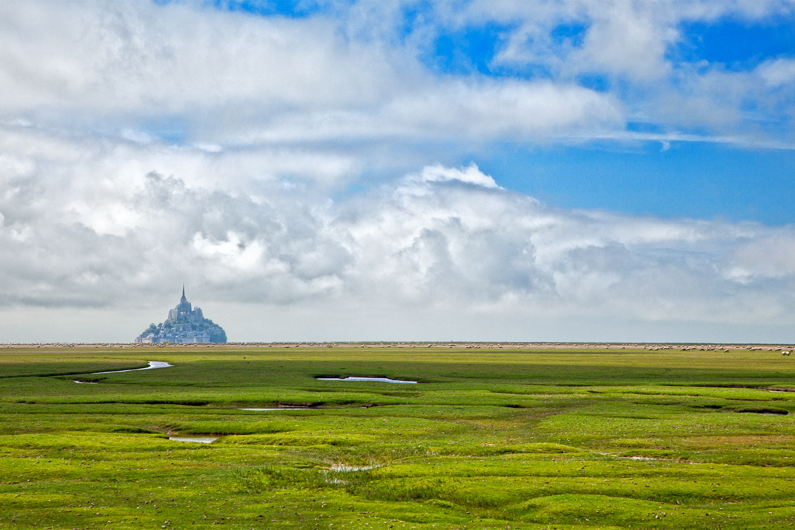

# PLANET RULER

**Measure planetary radii with nothing but a camera and science!**

[](https://www.gnu.org/licenses/agpl-3.0)
[](https://www.python.org/downloads/)
[](https://github.com/bogsdarking/planet_ruler/actions/workflows/ci.yml)

<div align="center">

**Got a horizon photo? Measure your planet in 3 lines of code!**

```python
import planet_ruler as pr
obs = pr.LimbObservation("horizon_photo.jpg")
obs.detect_limb().fit_limb()  # → Planet radius: 6,234 km
```

[Try Interactive Demo](notebooks/limb_demo.ipynb) • [Documentation](https://planet-ruler.readthedocs.io) • [Discussions](https://github.com/bogsdarking/planet_ruler/discussions)

</div>

---

<!--  -->

<div align="center">
<table>
<tr>
<td align="center" width="33%">

<br><b>Ground Level</b><br>
<em>~100 ft</em><br>
Horizon appears flat
</td>
<td align="center" width="33%">

<br><b>Commerical Aircraft</b><br>
<em>~35,000 ft</em><br>
Perceptible curvature
</td>
<td align="center" width="33%">

<br><b>International Space Station</b><br>
<em>~250 miles</em><br>
Dramatic spherical curvature
</td>
</tr>
</table>
</div>

<!-- <p style="text-align:right;">*From left to right: How horizon curvature changes with altitude, revealing the planetary radius beneath*</p> -->

<!-- *From left to right: How horizon curvature changes with altitude, revealing the planetary radius beneath* -->

## Quick Start

### Installation
```bash
# From source (development)
git clone https://github.com/bogsdarking/planet_ruler.git
cd planet_ruler && pip install -e .

# Command-line tool is now available
planet-ruler --help
```

### Python API
```python
import planet_ruler as pr

# Basic analysis
obs = pr.LimbObservation("photo.jpg", "config/earth_iss.yaml")
obs.detect_limb()  # AI-powered horizon detection
obs.fit_limb()     # Optimize planetary parameters
obs.plot()         # Visualize results

# Access results (requires custom analysis of fit parameters)
print(f"Fitted parameters: {obs.best_parameters}")
```

### Command Line
```bash
# Note: Full CLI is under development
# For now, use Python API:
import planet_ruler as pr
obs = pr.LimbObservation("photo.jpg", "config/earth_iss.yaml")

# Try built-in examples
planet-ruler demo --planet earth
```

## The Science Behind It

**The Problem**: How big is your planet?

**The Solution**: Depending on your altitude, planetary curvature becomes visible in the horizon. By measuring this curvature and accounting for your camera, we can reverse-engineer the planet's size.

<details>
<summary><strong>How It Works (Click to expand)</strong></summary>

1. **Capture**: Photograph showing horizon/limb from altitude
2. **Detect**: AI-powered horizon line detection
3. **Measure**: Extract curvature from the detected horizon
4. **Model**: Account for camera optics, altitude, and viewing geometry  
5. **Optimize**: Fit theoretical curves to observations using differential evolution
6. **Result**: Planetary radius with uncertainty estimates

**Mathematical Foundation**:
- Spherical geometry and horizon distance calculations
- Camera intrinsic/extrinsic parameter modeling
- Non-linear optimization with robust error handling

</details>

## Real Results

**Validated on actual space mission data:**

| **Planet** | **Source** | **Estimated** | **True Value** | **Error** |
|------------|------------|---------------|----------------|-----------|
| **Earth** | ISS Photo | 5,516 km | 6,371 km | **13.4%** |
| **Saturn** | Cassini | 65,402 km | 58,232 km | **12.3%** |
| **Pluto** | New Horizons | 1,432 km | 1,188 km | **20.6%** |


## Key Features

<table>
<tr>
<td width="50%">

**AI-Powered Detection**
- Segment Anything model for horizon detection
- Automatic limb/edge identification
- Robust to image noise and artifacts

**Advanced Camera Models**
- Camera parameter optimization (focal length, orientation)
- Multiple camera configurations supported
- Flexible parameter fitting framework

**Multi-Planetary Support**
- Earth, Saturn, Pluto examples included
- Extensible to any spherical body

</td>
<td width="50%">

**Scientific Rigor**
- Parameter uncertainty estimation from optimization populations
- Differential evolution optimization
- Mathematical validation with property tests

**Rich Visualizations**
- Interactive plots with matplotlib
- 3D planetary geometry views
- Step-by-step analysis breakdown

**Multiple Interfaces**
- Python API for scripting
- Command-line tool for automation
- Jupyter notebooks for exploration

</td>
</tr>
</table>

## Installation & Setup

### Requirements
- **Python 3.8+**
- **RAM**: 4GB+ recommended (for AI models)
- **Storage**: ~2GB for full installation with models1

### Install Options

<details>
<summary><strong>Quick Start (Recommended)</strong></summary>

```bash
# Clone and install in one go
git clone https://github.com/bogsdarking/planet_ruler.git
cd planet_ruler
pip install -e .

# Verify installation
planet-ruler --help
python -c "import planet_ruler; print('Ready to measure planets!')"
```
</details>

<details>
<summary><strong>Minimal Install (Core features only)</strong></summary>

```bash
git clone https://github.com/bogsdarking/planet_ruler.git
cd planet_ruler

# Install without heavy AI dependencies
pip install -e . --no-deps
pip install numpy scipy matplotlib pillow pyyaml pandas tqdm seaborn

# Note: Manual horizon detection required without segment-anything
```
</details>

<details>
<summary><strong>Development Install</strong></summary>

```bash
git clone https://github.com/bogsdarking/planet_ruler.git
cd planet_ruler

# Full development environment
pip install -e .
pip install -r requirements.txt
pip install -r requirements-test.txt

# Run tests to verify
pytest tests/ -v
```
</details>

### Troubleshooting
- **Segment Anything issues?** See [installation guide](docs/installation.rst)
- **M1 Mac problems?** Use conda for better compatibility
- **Memory errors?** Try the minimal install option

## Try It Now

### Interactive Demo
```python
# Launch interactive widget with examples (in Jupyter notebook)
from planet_ruler.demo import make_dropdown, load_demo_parameters
demo = make_dropdown()  # Choose Earth, Saturn, or Pluto
params = load_demo_parameters(demo)
```

### Use Your Own Photo
<table>
<tr>
<td width="50%">

**With Camera Config:**
```python
import planet_ruler as pr

# Best accuracy with camera specs
obs = pr.LimbObservation(
    "your_photo.jpg", 
    "config/your_camera.yaml"
)
obs.detect_limb()
obs.fit_limb()
```

</td>
<td width="50%">

**Quick & Simple:**
```python
import planet_ruler as pr

# Basic analysis
obs = pr.LimbObservation("your_photo.jpg")
obs.detect_limb()
obs.fit_limb()

print(f"Fitted radius: {obs.best_parameters['r']/1000:.0f} km")
```

</td>
</tr>
</table>

### Camera Configuration Template
```yaml
# config/your_camera.yaml
description: "Your camera setup"
free_parameters:
  - r  # planetary radius
  - h  # altitude
  - f  # focal length
  - w  # sensor width

init_parameter_values:
  r: 6371000      # Earth radius in meters
  h: 400000       # Altitude in meters
  f: 0.05         # Focal length in meters
  w: 0.035        # Sensor width in meters

parameter_limits:
  r: [1000000, 20000000]
  h: [100000, 1000000]
  f: [0.01, 0.2]
  w: [0.01, 0.1]
```

## Usage Examples

### Example 1: Earth from ISS
```python
import planet_ruler as pr

# Load ISS Earth photo with configuration
obs = pr.LimbObservation(
    "demo/images/iss064e002941.jpg",
    "config/earth_iss_1.yaml"
)

# Full analysis pipeline
obs.detect_limb()    # AI horizon detection
obs.fit_limb()       # Optimize planetary parameters
obs.plot()           # Visualize results

# Results
# Results require manual extraction from fitted parameters
print(f"Best fit parameters: {obs.best_parameters}")
print(f"Planetary radius (r): {obs.best_parameters['r']/1000:.0f} km")
```

### Example 2: Saturn from Cassini
```python
# Analyze Saturn's limb from Cassini spacecraft
obs = pr.LimbObservation(
    "demo/images/saturn_pia21341-1041.jpg",
    "config/saturn-cassini-1.yaml" 
)

# Two-step analysis
obs.detect_limb()  # detect horizon
obs.fit_limb()     # fit parameters

# Rich visualization
from planet_ruler.plot import plot_3d_solution
plot_3d_solution(**obs.best_parameters)  # 3D planetary geometry view
```

### Example 3: Command Line Usage
```bash
# Note: CLI is under development
# Use Python API for full functionality:
import planet_ruler as pr
obs = pr.LimbObservation("airplane_horizon.jpg", "config/your_setup.yaml")
obs.detect_limb()
obs.fit_limb()

# Run Saturn demo (in Jupyter notebook)
from planet_ruler.demo import make_dropdown, load_demo_parameters
```

## Documentation & Resources

### Learning Resources
| Resource | Description | Best For |
|----------|-------------|----------|
| [**Interactive Tutorial**](notebooks/limb_demo.ipynb) | Complete walkthrough with examples | **First-time users** |
| [**API Documentation**](https://planet-ruler.readthedocs.io) | Detailed function reference | **Developers** |
| [**Camera Setup Guide**](config/) | Configuration examples | **Custom setups** |
| [**Example Gallery**](demo/) | Real space mission results | **Inspiration** |

### Quick References
```python
# Core classes and functions
pr.LimbObservation(image_path, fit_config)  # Main analysis class
pr.geometry.horizon_distance(altitude, radius)      # Theoretical calculations  
pr.fit.optimize_parameters(obs, method='differential_evolution')  # Optimization
pr.plot.show_analysis(obs, style='comprehensive')   # Visualization

# Key methods
obs.detect_limb()     # AI-powered horizon detection
obs.fit_limb()        # Parameter optimization  
obs.detect_limb(); obs.fit_limb()  # Complete pipeline
obs.plot()            # Show results
```

## Use Cases & Applications

- **Astronomy courses**: Demonstrate planetary geometry concepts
- **Computer vision**: Real-world optimization and AI applications  
- **Mathematics**: Applied geometry and curve-fitting examples
- **Physics**: Observational techniques and measurement uncertainty

## Limitations & Best Practices

### **Accuracy Expectations**
- **Typical accuracy**: ~20%
- **Best case**: ~15% with optimal conditions and camera calibration (so far!)
- **Factors affecting precision**: Image quality, horizon clarity, altitude, camera specs

### **Technical Limitations**
- **Optimization challenges**: Complex parameter space → potential local minima
- **AI dependency**: Requires segment-anything model for auto-detection
- **Computational cost**: Can be slow on older hardware

### **Best Practices**
1. **Image quality**: Sharp, high-resolution horizons work best
2. **Altitude**: Higher = more curvature = better measurements  
3. **Camera knowledge**: Focal length and sensor specs improve results
4. **Horizon clarity**: Mountains, clouds, or haze reduce accuracy
5. **Run multiple optimizations** and compare results for consistency

## Contributing

**We welcome contributions from astronomers, developers, educators, and enthusiasts!**

### Quick Contribution Setup
```bash
# Fork the repo, then:
git clone https://github.com/YOUR_USERNAME/planet_ruler.git
cd planet_ruler
pip install -e . && pip install -r requirements.txt && pip install -r requirements-test.txt
pytest tests/ -v  # Verify everything works
```

### Ways to Contribute
| Type | Examples | Good For |
|------|----------|----------|
| **Bug Reports** | Detection failures, optimization issues | **Everyone** |
| **Features** | New algorithms, UI improvements | **Developers** |
| **Documentation** | Tutorials, examples, API docs | **Educators** |
| **Examples** | New planetary bodies, camera setups | **Researchers** |
| **Testing** | Edge cases, performance tests | **QA enthusiasts** |

### Contribution Guidelines
- **Found a bug?** → [Create an issue](https://github.com/bogsdarking/planet_ruler/issues/new?template=bug_report.md)
- **Have an idea?** → [Start a discussion](https://github.com/bogsdarking/planet_ruler/discussions)
- **Ready to code?** → See our [CONTRIBUTING.md](CONTRIBUTING.md) guide

> **First-time contributors welcome!** Look for issues labeled [`good first issue`](https://github.com/bogsdarking/planet_ruler/labels/good%20first%20issue)

## Project Status

[](https://github.com/bogsdarking/planet_ruler/actions/workflows/ci.yml)
[](https://github.com/bogsdarking/planet_ruler/actions)
[](https://planet-ruler.readthedocs.io/en/latest/?badge=latest)
[](https://python.org)

**Development Status**: Active development • Stable API • Beta testing

## Acknowledgments & References

### **Built With**
- [Segment Anything (Meta)](https://segment-anything.com/) - AI-powered horizon detection
- [SciPy](https://scipy.org/) - Scientific optimization algorithms  
- [NumPy](https://numpy.org/) - High-performance numerical computing
- [Matplotlib](https://matplotlib.org/) - Publication-quality visualizations

### **Scientific References**
- [Horizon geometry fundamentals](https://en.wikipedia.org/wiki/Horizon) - Basic theory
- [Camera calibration techniques](https://courses.cs.washington.edu/courses/cse455/09wi/Lects/lect5.pdf) - Optics modeling
- [Earth curvature visibility](https://earthscience.stackexchange.com/questions/7283/) - Observational considerations
- [Camera resectioning methods](https://en.wikipedia.org/wiki/Camera_resectioning) - Parameter estimation
- [Intrinsic camera parameters](https://ksimek.github.io/2013/08/13/intrinsic/) - Mathematical foundations

### **Inspiration**
If you've ever wondered about the size of your planet, you are not alone -- humanity has tried to measure this [throughout the ages](https://en.wikipedia.org/wiki/History_of_geodesy). Though Earth is large enough to defy the usual methods we have for measuring things, a creative mind can do it with surprisingly little. Eratosthenes, in ancient Greece, was able to do it to impressive accuracy using only a rod and the sun. How much better can we do today?

## License

**GNU Affero General Public License v3.0** - see [LICENSE](LICENSE) file for details.

---

<div align="center">

__μεταξὺ δὲ τοῦ πυρὸς καὶ τῶν δεσμωτῶν__<br />between the fire and the captives -- Plato

[⭐ Star this repo](https://github.com/bogsdarking/planet_ruler/stargazers) • [Report issues](https://github.com/bogsdarking/planet_ruler/issues) • [Join discussions](https://github.com/bogsdarking/planet_ruler/discussions)

*Made with ❤️ for curious minds exploring our cosmic neighborhood*

</div>