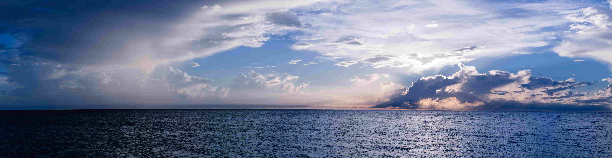

Planet Ruler Documentation
==========================

**Measure planets with nothing but a camera.**

Overview
--------

Planet Ruler is an open-source Python library for measuring planetary radii from photographs using computer vision 
and geometric optimization. The project serves an educational mission, making planetary science accessible to educators, 
students, researchers, and hobbyists using consumer cameras and smartphones.

The method works by analyzing the curved shape of the visible horizon in photographs taken from altitude. 
Earth's curvature becomes geometrically detectable from as little as **1-34 meters** above the surface with 
modern cameras, though the "sweet spot" for clear measurements is high-altitude photography 
(balloon flights, aircraft, satellites) where curvature is obvious and easily measured.

Core Principles
~~~~~~~~~~~~~~~

* **Transparency over automation**: Users are involved in assumptions and trade-off decisions rather than relying on black-box algorithms
* **Method-agnostic design**: No favoratisim; broad toolbox fosters comparative learning
* **Scientifically rigorous**: Real measurements, honest uncertainty
* **Educational accessibility**: Complete documentation from geometric foundations to implementation details

Key Features
------------

**Three Computer Vision Approaches**

* **Manual annotation**: Interactive GUI for precise limb point selection and user engagement
* **Gradient-field optimization**: Novel detection-free method using image gradients and multi-resolution processing
* **ML segmentation**: Fully automated (or user-assisted) scene segmentation

**Comprehensive Toolset**

* **Automatic configuration**: EXIF metadata extraction for camera parameters across multiple manufacturers
* **Image preprocessing**: Cropping, orientation correction, gradient enhancement
* **Robust optimization**: Global optimizers (differential evolution, basin-hopping, dual annealing)
* **Uncertainty quantification**: Bootstrap resampling and covariance estimation
* **Benchmarking framework**: Systematic performance testing with YAML configuration and SQLite storage
* **Professional CI/CD**: 700+ tests, comprehensive coverage analysis, automated deployment

**Multi-Platform Support**

* Command-line interface for batch processing
* Python API for programmatic access
* Interactive Jupyter notebooks for education
* Cross-platform (Linux, macOS, Windows)

How It Works
------------

When photographed from altitude, Earth's horizon appears as a curved arc rather than a straight line. The arc's curvature encodes the relationship between planetary radius :math:`R`, observation altitude :math:`h`, and camera orientation. By measuring this curvature with known camera parameters, we can infer :math:`R` (if :math:`h` is known) or :math:`h` (if :math:`R` is known).

The mathematical foundation relates horizon distance :math:`d_h` to planetary geometry:

.. math::

   d_h = \sqrt{2Rh + h^2} \approx \sqrt{2Rh}

For typical aircraft altitudes (10-20 km), the horizon is approximately 357-505 km away, creating measurable curvature in camera images with 4000+ pixel resolution.

**Key Insight**: The sagitta (vertical extent of the curved horizon) scales as :math:`s \propto \sqrt{h}`, meaning higher altitude provides gradually improving signal rather than dramatic threshold effects. This enables measurements across a wide altitude range.

Quick Start
-----------

Determine Earth's radius from a horizon photograph:

.. code-block:: python

   from planet_ruler.observation import LimbObservation
   
   # Load image with camera configuration
   obs = LimbObservation(
       image_filepath="horizon_image.jpg",
       fit_config="config/earth_balloon.yaml"
   )
   
   # Manual annotation (most accurate, educational)
   obs.detect_limb(detection_method="manual")
   obs.fit_limb()
   
   # Display results with uncertainty
   print(f"Radius: {obs.radius_km:.1f} ± {obs.radius_uncertainty:.1f} km")
   print(f"Altitude: {obs.altitude_km:.1f} km")
   
   # Visualize fit
   obs.plot()

**Alternative detection methods:**

.. code-block:: python
   
   # Detect horizon using gradient-field method (automatic, lightweight)
   obs.fit_limb(
       loss_function="gradient_field",
       resolution_stages="auto",  # Multi-resolution optimization
       max_iter=1000
   )

   # Segmentation (robust to scene complexity)
   obs.detect_limb(detection_method="segmentation")
   obs.smooth_limb(method="rolling-median", window_length=15)
   obs.fit_limb()

For Earth from commercial flight altitude (~10 km), expect radius measurements of 6371 ± 50 km. Higher precision requires careful calibration and multiple images.

**Image preprocessing:**

.. code-block:: python

   # Crop to region of interest for faster processing
   obs.crop_image()
   
   # Automatic EXIF-based configuration
   from planet_ruler.camera import create_config_from_image
   auto_config = create_config_from_image("IMG_1234.jpg", altitude_m=10_000)
   obs = LimbObservation(
       image_filepath="horizon_image.jpg",
       fit_config=auto_config
   )

Scientific Background
---------------------

The :doc:`science` documentation covers:

* **Historical methods**: Eratosthenes (240 BCE) to modern satellite geodesy
* **Geometric foundations**: Limb arc concept and horizon distance formulas
* **Minimum detectable altitude**: Earth's curvature visible from 1-34m with modern cameras
* **Camera specifications**: How sensor resolution and focal length determine measurement capability
* **Mathematical methodology**: Coordinate transforms, projection, and optimization
* **Detection approaches**: Manual, gradient-field, and segmentation methods
* **Gradient-field theory**: Flux-based cost functions and multi-resolution strategy

The key scientific contribution is demonstrating that Earth's curvature is **geometrically detectable from ground level** with consumer equipment — the "sweet spot" exists because curvature becomes *obvious and easily measured* at aircraft altitudes, not because it's invisible below them.

Contents
--------

.. toctree::
   :maxdepth: 2
   :caption: Science:
   
   science

.. toctree::
   :maxdepth: 2
   :caption: Documentation:

   installation
   tutorials
   examples
   api
   modules

.. toctree::
   :maxdepth: 1
   :caption: Development:

   testing
   benchmarks
   contributing

Indices and tables
==================

* :ref:`genindex`
* :ref:`modindex` 
* :ref:`search`