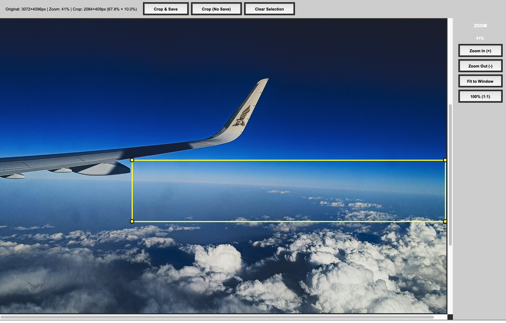
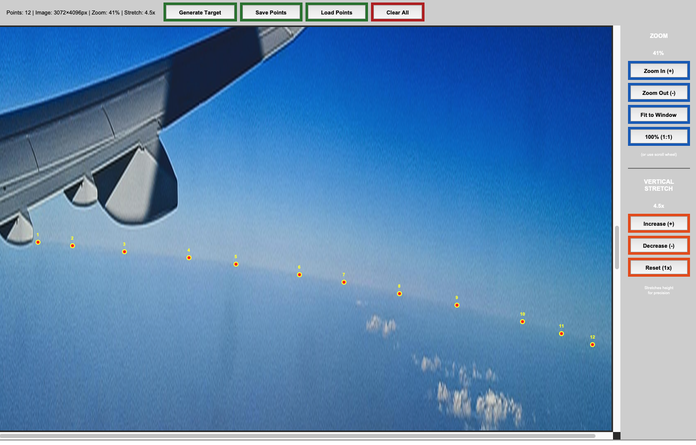

**The flagship Planet Ruler experience - accessible science with everyday tools.**

This tutorial shows you how to measure Earth's radius using nothing but your smartphone camera from an airplane window. It's the perfect introduction to practical astronomy and demonstrates why Planet Ruler exists: to make planetary science accessible to everyone.

Prerequisites
~~~~~~~~~~~~~

* A smartphone or camera with EXIF data
* A window seat on a commercial flight
* Basic knowledge of your flight altitude
* 30 minutes during flight + 15 minutes for analysis

.. note::
   **Perfect for:** Students, teachers, curious travelers, anyone with a window seat and a sense of wonder! No special equipment needed.

The Science: Why This Works
~~~~~~~~~~~~~~~~~~~~~~~~~~~

From the ground, Earth's horizon appears flat. But climb to 35,000 feet in an airplane, and you'll see the horizon curve. This isn't an optical illusion - you're seeing Earth's actual roundness.

The higher you go, the more curvature becomes visible. By measuring how much the horizon curves in your photo and knowing your altitude, you can reverse-engineer Earth's radius.

**Historical Context**: Ancient Greek scientist Eratosthenes measured Earth's circumference using a stick and the sun around 240 BCE. You're doing something conceptually similar, but with modern tools that fit in your pocket!

Part 1: Taking Your Photo
~~~~~~~~~~~~~~~~~~~~~~~~~

Best Timing
^^^^^^^^^^^

**When to photograph:**

* **Altitude:** 25,000 - 40,000 feet (typical commercial cruise altitude)
* **Timing:** After reaching cruising altitude (~30-40 minutes into flight)
* **Weather:** Clear day with visible horizon
* **Position:** Window seat, preferably away from wing

**What makes a good photo:**

| ✅ Clear, unobstructed horizon line
| ✅ Minimal clouds at horizon level
| ✅ Camera roughly level with horizon (not tilted)
| ✅ Horizon in middle third of frame
| ✅ Good lighting (avoid shooting into sun)

**What to avoid:**

| ❌ Wing blocking the view
| ❌ Heavy cloud layer at horizon
| ❌ Scratched or dirty windows (some OK, but avoid major obstructions)
| ❌ Excessive zoom (normal or wide-angle is best)

Photography Tips
^^^^^^^^^^^^^^^^

.. code-block:: text

   Step-by-step:
   
   1. Wait for cruising altitude (seatbelt sign off)
   2. Position yourself close to window, sitting upright
   3. Keep phone/camera level (don't tilt up or down)
   4. Turn OFF flash
   5. Focus on the horizon line
   6. Take 5-10 photos (increases your chances of a good one)
   7. Note the time for altitude lookup later

.. tip::
   **Camera settings (if adjustable):**
   
   * Use HDR mode if available
   * Capture at highest resolution
   * Turn off digital zoom
   * Let auto-exposure handle brightness

Part 3: Finding Your Altitude
~~~~~~~~~~~~~~~~~~~~~~~~~~~~~

You need to know your altitude when you took the photo. Here are four methods, from most to least accurate:

Method 1: FlightRadar24 (Recommended)
^^^^^^^^^^^^^^^^^^^^^^^^^^^^^^^^^^^^^

**Real-time tracking:**

.. code-block:: text

   1. Open FlightRadar24 app (free version works)
   2. Search for your flight number
   3. Note altitude when you took photos
   4. Screenshot for reference

**Post-flight lookup:**

.. code-block:: text

   1. Visit flightradar24.com
   2. Search your flight number and date
   3. Use playback feature to find your photo timestamp
   4. Read the altitude at that moment
   
   Example: "AA1234 on Nov 4 at 14:23 UTC: 35,000 feet"

Method 2: In-Flight Display
^^^^^^^^^^^^^^^^^^^^^^^^^^^

Many aircraft show altitude on seatback screens or overhead displays.

.. code-block:: text

   1. Take photo of altitude display when you photograph horizon
   2. Note the altitude in feet
   3. Convert to meters: altitude_m = altitude_ft × 0.3048
   
   Example: 35,000 feet = 10,668 meters

Method 3: Ask the Flight Crew
^^^^^^^^^^^^^^^^^^^^^^^^^^^^^

Flight attendants usually know the cruising altitude:

.. code-block:: text

   Polite question: "Hi! I'm doing a science project measuring Earth's 
   curvature. Could you tell me our cruising altitude today?"
   
   Typical answer: "We're at 37,000 feet today."

Method 4: Estimate from Flight Type
^^^^^^^^^^^^^^^^^^^^^^^^^^^^^^^^^^^

If you can't get exact altitude, use these typical values:

.. list-table:: Typical Cruise Altitudes
   :header-rows: 1
   :widths: 40 30 30

   * - Flight Type
     - Altitude (feet)
     - Altitude (meters)
   * - Domestic short-haul
     - 30,000 - 35,000
     - 9,144 - 10,668
   * - Domestic long-haul
     - 35,000 - 39,000
     - 10,668 - 11,887
   * - International
     - 37,000 - 41,000
     - 11,278 - 12,497

.. warning::
   **Altitude is the dominant error source.** At cruise altitude (~10 km), the inferred radius
   amplifies altitude uncertainty by roughly R/h ≈ 637×. A ±2,000 ft (±610 m) uncertainty adds
   ~6% to your radius measurement; GPS altitude (~30 m) reduces this below 0.5%. Altitude
   accuracy matters more than image quality or annotation precision—get it as precisely as you can.

Part 4: Analysis with Planet Ruler
~~~~~~~~~~~~~~~~~~~~~~~~~~~~~~~~~~

Now for the fun part - let's measure Earth's radius!

Zero-Config Workflow
^^^^^^^^^^^^^^^^^^^^

Planet Ruler's auto-config feature extracts camera parameters from your photo's EXIF data:

.. code-block:: python

   import planet_ruler as pr
   from planet_ruler.camera import create_config_from_image
   from planet_ruler.uncertainty import calculate_parameter_uncertainty
   from planet_ruler.fit import format_parameter_result
   
   # Your airplane photo and altitude
   photo_path = "airplane_horizon.jpg"  # Your actual photo filename
   altitude_meters = 10668  # 35,000 feet = 10,668 meters
   
   # Auto-detect camera from EXIF data
   config = create_config_from_image(
       image_path=photo_path,
       altitude_m=altitude_meters,
       planet="earth",
       limits_preset="balanced",  # "tight", "balanced" (default), or "loose"
   )
   
   # See what was detected
   print("Auto-detected camera:")
   camera_info = config["camera_info"]
   print(f"  Model: {camera_info.get('camera_model', 'Unknown')}")
   f_mm = config["init_parameter_values"]["f"] * 1000
   w_mm = config["init_parameter_values"]["w"] * 1000
   print(f"  Focal length: {f_mm:.1f} mm")
   print(f"  Sensor width: {w_mm:.1f} mm")

   # Create observation
   obs = pr.LimbObservation(photo_path, config)

Image Cropping (Optional)
^^^^^^^^^^^^^^^^^^^^^^^^^

Sometimes obstructions are unavoidable. If you end up with a photo that contains a window frame,
airplane wing, or other object that either obscures the horizon directly or could confuse the fit, 
cropping is a great option. To get started, simply run the `crop_image` method. You'll get a pop-up GUI 
containing your image where you can drag a rectangle that will contain the area you want to keep.
Try to get as much of the horizon as you can while avoiding whatever is obscuring it.

.. code-block:: python

   obs.crop_image()

GUI controls

.. code-block:: text

   Crop Tool Controls:
   Click & Drag     Select crop region
   Scroll Wheel     Zoom in/out
   +/- Keys         Zoom in/out
   Esc              Clear selection
   
   Buttons:
   Crop & Save      Apply crop and save to disk
   Crop (No Save)   Crop in-memory only
   Clear Selection  Remove crop region

   Drag the crop rectangle to select a region without obstuctions.

.. note::
   Cropping the image implicitly changes the camera parameters (field of view, for one). Planet-ruler compensates for this by automatically re-scaling those parameters appropriately after you crop.

Horizon Detection
^^^^^^^^^^^^^^^^^

Use manual annotation for precise, user-controlled detection.

.. code-block:: python
   
   obs.detect_limb(detection_method="manual")

GUI controls

.. code-block:: text

   Crop Tool Controls:
   Left Click        Place horizon point
   Right Click       Remove previous point
   Scroll Wheel      Zoom in/out
   +/- Keys          Zoom in/out
   
   Zoom Buttons:
   Generate Target   Save points to memory (ok to close window after)
   Save Points       Save points to disk for usage later
   Load Points       Load a previous set of points
   Clear all         Remove all points
   Zoom In/Out       Zoom in/out
   Fit to Window     Zoom to fit image vertically
   100% (1:1)        Zoom to full resolution

   Vertical Stretch Buttons:
   Increase          Stretch image vertically (increases apparent curvature)
   Decrease          Relax image vertically (decreases apparent curvature)
   Reset (1x)        Restore original vertical ratio

.. tip::
   **Clicking strategy:** Click 10-15 points spread evenly across the horizon. More points near areas of high curvature, fewer where horizon is straighter. Don't be shy with the vertical stretch button -- this makes it dramatically easier to see the curve and place points accurately.

   Annotating using a 4.5x vertical stretch.

Parameter Fitting
^^^^^^^^^^^^^^^^^

Now fit the planetary radius to match your detected horizon:

.. code-block:: python

   # Fit Earth's radius
   print("\nFitting planetary parameters...")
   obs.fit_arc(
       minimizer='differential-evolution',
       max_iter=1000,
       seed=42
   )

   print("✓ Fit completed!")

Results and Uncertainty
^^^^^^^^^^^^^^^^^^^^^^^

Extract your measurement with uncertainty quantification:

.. code-block:: python

   # Calculate radius with uncertainty
   radius_result = calculate_parameter_uncertainty(
       obs, "r", 
       scale_factor=1000,  # Convert meters to kilometers
       method='auto',
       confidence_level=0.68  # 1-sigma (68%)
   )
   
   # Display results
   print("\n" + "="*50)
   print("YOUR MEASUREMENT OF EARTH'S RADIUS")
   print("="*50)
   print(format_parameter_result(radius_result, "km"))
   
   # Compare to known value
   known_earth_radius = 6371.0  # km
   error = abs(radius_result['value'] - known_earth_radius)
   percent_error = 100 * error / known_earth_radius
   
   print(f"\nKnown Earth radius: {known_earth_radius:.0f} km")
   print(f"Your error: {error:.1f} km ({percent_error:.1f}%)")
   
   if percent_error < 15:
       print("🎉 Excellent measurement!")
   elif percent_error < 25:
       print("👍 Good measurement!")
   else:
       print("📊 Try another photo for better accuracy")

Expected Output
^^^^^^^^^^^^^^^

.. code-block:: text

   Auto-detected camera:
     Apple iPhone 14 Pro
     Focal length: 24.0 mm
     Sensor width: 9.8 mm
     Field of view: 75.6°
   
   Click points along the horizon curve...
   ✓ 22 points selected
   
   Fitting planetary parameters...
   ✓ Fit completed!
   
   ==================================================
   YOUR MEASUREMENT OF EARTH'S RADIUS
   ==================================================
   r = 6234 ± 156 km
   
   Known Earth radius: 6371 km
   Your error: 137 km (2.2%)
   🎉 Excellent measurement!

Part 5: Understanding Your Results
~~~~~~~~~~~~~~~~~~~~~~~~~~~~~~~~~~

What to Expect
^^^^^^^^^^^^^^

**Typical Results:**

* Measured radius: 5,500 - 7,200 km
* True Earth radius: 6,371 km  
* Typical error: 10-25%

.. note::
   Even with 10-25% error, you've measured something the size of a **planet** using just your phone! That's remarkable. Professional measurements use satellites and achieve centimeter precision, but your result is scientifically meaningful.

Sources of Error
^^^^^^^^^^^^^^^^

Understanding why your measurement isn't exactly 6,371 km:

**1. Altitude Uncertainty (±5-10% effect)**

* In-flight displays are approximate
* Barometric altitude vs. GPS altitude differ
* Your location along the flight path varies

**2. Camera Parameters (±5-10% effect)**

* EXIF focal length is approximate
* Lens distortion (especially wide-angle phones)
* Sensor size database contains estimates
* Field-of-view calculation assumptions

**3. Horizon Detection (±3-8% effect)**

* Manual clicking precision (±50-200 pixels)
* Atmospheric haze obscures true horizon
* Window clarity and cleanliness
* Your hand stability when photographing

**4. Atmospheric Refraction (±1-3% effect)**

* Light bends through atmosphere
* Makes horizon appear slightly lower than geometric position
* Not modeled in basic analysis

**5. Earth's Shape (±0-2% effect)**

* Earth is oblate (squashed): equatorial radius 6,378 km, polar radius 6,357 km
* We assume a perfect sphere with mean radius 6,371 km
* Your location matters slightly

.. tip::
   **The key insight:** Despite these errors, you successfully measured a planetary-scale object! Understanding error sources is as educational as getting the "right" answer.

Improving Your Accuracy
^^^^^^^^^^^^^^^^^^^^^^^

Want better results? Try these techniques:

**Multiple Measurements**

.. code-block:: python

   # Analyze 3-5 photos from same flight
   photos = ["photo1.jpg", "photo2.jpg", "photo3.jpg"]
   results = []
   
   for photo in photos:
       config = create_config_from_image(photo, altitude_m=10668, planet="earth")
       obs = pr.LimbObservation(photo, config)
       obs.detect_limb(detection_method="manual")
       obs.smooth_limb()
       obs.fit_arc(max_iter=1000)
       
       radius_result = calculate_parameter_uncertainty(
           obs, "r", scale_factor=1000, method='auto'
       )
       results.append(radius_result['value'])
   
   # Average reduces random error
   import numpy as np
   print(f"Mean radius: {np.mean(results):.1f} km")
   print(f"Std deviation: {np.std(results):.1f} km")

**Better Altitude Data**

* GPS logger apps (more accurate than barometric)
* Post-flight FlightRadar24 playback (most accurate)
* Average altitude over 5-minute window

**Optimal Photography**

* Clear day, minimal clouds
* Clean windows (wipe if possible!)
* Multiple exposures to ensure good quality
* Steady hand or brace against window frame

**Automated Detection**

For more consistent results across multiple photos:

.. code-block:: python

   # Gradient-field optimization (no manual clicking, no detect_limb needed)
   obs.fit_gradient(
       resolution_stages='auto',
       max_iter=800
   )

Part 6: Educational Extensions
~~~~~~~~~~~~~~~~~~~~~~~~~~~~~~

Class Projects
^^^^^^^^^^^^^^

**Individual Project:**

1. Each student takes photos on a flight
2. Analyze individually with Planet Ruler  
3. Compare results in class
4. Discuss error sources

**Group Data Collection:**

* Pool results from entire class
* Plot altitude vs. measurement accuracy
* Identify patterns (time of day, location, weather)
* Statistical analysis of combined data

Discussion Questions
^^^^^^^^^^^^^^^^^^^^

1. **Measurement Comparison**
   
   * Who achieved the highest accuracy?
   * What made their photo better?
   * How did altitude affect results?

2. **Error Analysis**
   
   * Which error source was largest for your measurement?
   * How could we reduce each type of error?
   * What would professional scientists do differently?

3. **Historical Context**
   
   * How did Eratosthenes measure Earth 2,300 years ago?
   * How accurate was his measurement?
   * Why couldn't ancient scientists use this airplane method?

4. **Planetary Perspective**
   
   * What does your measurement tell you about Earth's size?
   * How does horizon curvature change with altitude?
   * Could you measure Mars this way if you were there?

Advanced Challenges
^^^^^^^^^^^^^^^^^^^

**Challenge 1: Altitude vs. Accuracy**

*Hypothesis:* Higher altitude gives more accurate measurements

.. code-block:: text

   1. Collect photos from flights at different altitudes
   2. Process all with Planet Ruler
   3. Plot: Altitude (x) vs. Measurement Error (y)
   4. Is there a relationship?

**Challenge 2: Earth's Oblateness**

*Question:* Can you detect that Earth is oblate (flattened at poles)?

.. code-block:: text

   1. Compare flights near equator (radius ~6,378 km)
      vs. near poles (radius ~6,357 km)
   2. Does your measurement reflect this 21 km difference?
   3. How much precision would you need?

**Challenge 3: Weather Balloon**

*Extension:* Measure from a weather balloon

.. code-block:: text

   1. Weather balloons reach ~100,000 feet
   2. Much more curvature visible
   3. Could achieve <5% accuracy
   4. Great science fair project!

Part 7: Troubleshooting
~~~~~~~~~~~~~~~~~~~~~~~

Common Issues
^^^^^^^^^^^^^

**"The detection isn't finding my horizon"**

Solution: Use manual annotation (``method="manual"``). You control every point, so it works with challenging images.

**"My result is way off (like 100,000 km)"**

Check:
* Altitude is in meters, not feet (35,000 ft = 10,668 m)
* Horizon is clearly visible in photo
* You clicked along the actual horizon (not clouds or terrain)

**"GUI window won't open"**

On Linux: ``sudo apt-get install python3-tk``

On Mac/Windows: tkinter should be pre-installed

**"Camera not in database"**

Override with manual field-of-view:

.. code-block:: python

   # Use "loose" preset to give the optimizer more room when metadata is uncertain
   config = create_config_from_image(
       photo_path,
       altitude_m=10668,
       planet="earth",
       limits_preset="loose",       # Wide search bounds
       param_tolerances={"f": 0.5}  # Extra slack on focal length
   )

**"My photo has the aircraft wing in it"**

Use the crop tool to remove obstructions:

.. code-block:: python

   from planet_ruler.crop import crop_observation_image
   
   # Interactive crop to remove wing
   cropped_img, scaled_params, crop_bounds = crop_observation_image(
       image_path="airplane_photo.jpg",
       initial_parameters=config['observation']
   )
   
   # Instructions will appear:
   # - Drag to select region without wing
   # - Ensure full horizon arc is included
   # - Click "Crop & Save" when done
   
   # Save cropped image
   cropped_img.save("airplane_photo_cropped.jpg")
   
   # Update config with scaled parameters
   config['observation'].update(scaled_params)
   
   # Continue with normal workflow
   obs = pr.LimbObservation("airplane_photo_cropped.jpg", config)

**"Result varies between photos"**

Normal! Try:
* Average multiple measurements
* Use consistent horizon detection method
* Ensure photos are all from similar altitude

Command Line Alternative
^^^^^^^^^^^^^^^^^^^^^^^^

For batch processing or simpler workflow:

.. code-block:: bash

   # One command to measure
   planet-ruler measure \\
       --auto-config \\
       --altitude 10668 \\
       --planet earth \\
       --detection-method manual \\
       airplane_photo.jpg
   
   # With custom field-of-view
   planet-ruler measure \\
       --auto-config \\
       --altitude 10668 \\
       --field-of-view 75 \\
       airplane_photo.jpg

Next Steps
~~~~~~~~~~

**Continue Learning:**

* Try :doc:`examples` for real spacecraft data
* Explore :doc:`api` for advanced techniques  
* Read about :doc:`tutorial_method_selection` to understand trade-offs

**Share Your Science:**

* Post your result on social media with #PlanetRuler
* Submit photos to the Planet Ruler community gallery (if available)
* Help other students measure their data

**Go Deeper:**

* Analyze multiple flights at different latitudes
* Compare to other measurement methods (GPS, maps)
* Build a class dataset and do statistical analysis
* Write up results as a science fair project

Summary
~~~~~~~

**Congratulations!** You've measured Earth's radius from an airplane window using nothing but your smartphone. You're part of a scientific tradition going back millennia, but with tools that would have amazed ancient astronomers.

**Key Takeaways:**

* Earth's curvature is real and measurable from commercial flights
* Everyday tools can do meaningful science
* Understanding error is as important as the measurement itself  
* Experimental science is about process, not just "correct" answers

**The Big Picture:**

Even if your measurement had 20% error, you:

* Engaged with the scientific method
* Made a real observation of our planet
* Quantified uncertainty in your data
* Connected ancient science to modern tools

That's what science is about. Well done!

.. tip::
   **For Educators:** This tutorial aligns with NGSS standards for Earth and Space Sciences (ESS1), Engineering Design (ETS1), and Common Core Math standards for Geometry and Statistics. Consider using as a semester-long project with data collection, analysis, and presentation components.