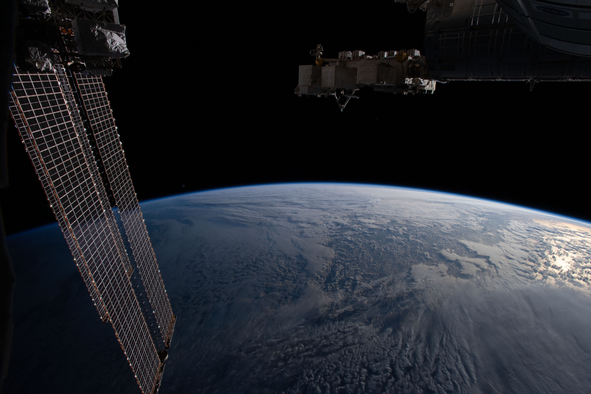

Tutorial: Choosing a Detection Method
=====================================

**How to decide between Manual Annotation, Gradient-Field, and ML Segmentation**

Planet Ruler offers three distinct methods for horizon detection, each with different trade-offs. This guide helps you choose the best method for your specific use case.

Quick Decision Tree
-------------------

.. mermaid::

   flowchart TD
       Start([Start]) --> Q1{Is horizon obstructed?}
       
       Q1 -->|YES| Q2{GPU Available?}
       Q1 -->|NO| Q3{Smooth horizon line?}
       
       Q2 -->|YES| ML1[ML Segmentation: Interactive Mode]
       Q2 -->|NO| Manual1[Manual Annotation: Click around obstructions]
       
       Q3 -->|YES| Q4{Prefer automated?}
       Q3 -->|NO| Q2

       Q4 -->|YES| Q5{GPU Available?}
       Q4 -->|NO| Manual2[Manual Annotation: Fast & foolproof]
              
       Q5 -->|YES| ML2[ML Segmentation: Automatic mode]
       Q5 -->|NO| Gradient1[Gradient-Field: Fast, lightweight]

       style Manual1 fill:#90EE90
       style Manual2 fill:#90EE90
       style Gradient1 fill:#87CEEB
       style ML1 fill:#FFB6C1
       style ML2 fill:#FFB6C1

Method Overview
---------------

Comparison Table
~~~~~~~~~~~~~~~~

.. list-table:: Detection Method Comparison
   :header-rows: 1
   :widths: 20 25 25 30

   * - Feature
     - Manual Annotation
     - Gradient-Field
     - ML Segmentation
   * - **Setup Time**
     - Instant (built-in)
     - Instant (built-in)
     - 5-10 min (first time model download)
   * - **Processing Time**
     - 30-120 sec (user-dependent)
     - 15-60 sec (automated)
     - 30-300 sec (model inference)
   * - **Dependencies**
     - None (tkinter only)
     - None (scipy only)
     - PyTorch + SAM (~2GB)
   * - **Memory Usage**
     - <100 MB
     - <200 MB
     - 2-4 GB
   * - **Accuracy**
     - Highest (user-controlled)
     - Good (clear horizons)
     - Variable (depends on scene)
   * - **Robustness**
     - Works everywhere
     - Needs clear edges
     - Handles complexity
   * - **Reproducibility**
     - Low (user variation)
     - High (deterministic)
     - High (deterministic)
   * - **Batch Processing**
     - Not practical
     - Excellent
     - Good (if GPU available)
   * - **Educational Focus**
     - Hands-on data
     - Mathematics/Physics
     - Machine Learning

Method 1: Manual Annotation
---------------------------

**Best for:** First-time users, educational settings, challenging images

How It Works
~~~~~~~~~~~~~

Manual annotation uses an interactive GUI where you click points along the horizon.

.. image:: images/manual_earth_native.png
   :alt: Screenshot of manual annotation
   :width: 800px

It also lets you stretch the image vertically to exaggerate curvature and enhance accuracy.

.. image:: images/manual_earth.png
   :alt: Screenshot of manual annotation using image stretch
   :width: 800px

**Strengths:**

| ✅ **Universal applicability** - Works with any image that has a visible horizon
| ✅ **No dependencies** - Works immediately after installing Planet Ruler
| ✅ **Educational** - Students learn by actively identifying the horizon
| ✅ **Handles complexity** - Clouds, haze, wing, terrain? You decide what's horizon

**Limitations:**

| ❌ **User-dependent** - Different people get slightly different results
| ❌ **Time-consuming** - Takes 30-120 seconds per image
| ❌ **Not batch-friendly** - Must manually process each image
| ❌ **Requires practice** - Takes a few tries to get good at point placement

When to Use
~~~~~~~~~~~

Use manual annotation when:

* You're analyzing 1-5 images
* Image quality is poor (scratched windows, haze, clouds)
* The horizon is ambiguous, obstructed, and/or complex
* You want hands-on learning
* You need to work immediately without dependencies

Example Usage
~~~~~~~~~~~~~

.. code-block:: python

   import planet_ruler as pr
   
   # Load observation
   obs = pr.LimbObservation("image.jpg", "config.yaml")
   
   # Manual annotation (opens GUI)
   obs.detect_limb(method="manual")
   
   # Fit annotated points
   obs.fit_limb(maxiter=1000)

.. tip::
   **Best practices for clicking:**
   
   * Cover as much horizontal area as you can
   * Click 10-20 points (more isn't always better)
   * Concentrate points where curvature is higher
   * Zoom in or use Stretch for precision
   * Right click (undo) or clear points to undo bad placements

Visual Examples
~~~~~~~~~~~~~~~

.. list-table::
   :widths: 50 50
   :class: borderless

   * - .. figure:: ../demo/images/2013-08-05_22-42-14_Wikimania.jpg
          :width: 100%

          Raw image

     - .. figure:: images/manual_earth_native.png
          :width: 100%
          :height: 247px
          
          Human-Annotated
          
   * - .. figure:: images/manual_earth_fitted.png
          :width: 100%
          
          Planet radius fitted

     - .. figure:: images/manual_earth_residuals.png
          :width: 100%
          :height: 247px
          
          Fit residuals

**Example 1: Clear Horizon**

   Manual annotation goes quickly with clear horizons.

**Example 2: Obstructions**

   User can avoid obstructions that can be tricky for automated methods.

**Example 3: Complex Scene**

.. figure:: images/plane-wing-airplane-aerial-fe58830ec52da51eed2a92d1a94e1e04.jpg
   :width: 100%
   
   Anything besides a human would struggle with this.

Method 2: Gradient-Field Detection
----------------------------------

**Best for:** Batch processing, clear horizons, reproducible workflows

How It Works
~~~~~~~~~~~~

Gradient-field detection skips explicit horizon detection entirely. Instead, it optimizes parameters directly on the image using brightness gradients perpendicular to the predicted horizon.

.. figure:: images/good_gradient.png
   :width: 100%

   A 'good' horizon is one with high brightness gradient (flux) traversing its boundary.

The method uses multi-resolution optimization (coarse → fine) to avoid local minima.

**Strengths:**

| ✅ **Fully automated** - No user interaction require
| ✅ **Lightweight** - No ML models, low memory usage
| ✅ **Reproducible** - Same image → same result every time
| ✅ **Fast** - Processes images in around a minute
| ✅ **Batch-friendly** - Perfect for processing hundreds of images
| ✅ **Multi-resolution** - Robust to initialization

**Limitations:**

| ❌ **Needs clear edges** - Struggles with diffuse or gradual horizons
| ❌ **Sensitive to obstruction** - Horizon obsturctions can confuse it
| ❌ **No visual feedback** - You don't see the detected horizon until after fitting
| ❌ **Parameter tuning** - May need to adjust smoothing parameters

When to Use
~~~~~~~~~~~

Use gradient-field when:

* You're batch processing many images (10+)
* Horizons are sharp and well-defined
* You want reproducible results
* You don't have time for manual annotation
* You want lightweight processing (no GPU needed)
* Images are clean with minimal obstruction

Example Usage
~~~~~~~~~~~~~

.. code-block:: python

   import planet_ruler as pr
   
   # Load observation
   obs = pr.LimbObservation("image.jpg", "config.yaml")
   
   # Gradient-field optimization (no detection step!)
   obs.fit_limb(
       loss_function='gradient_field',
       resolution_stages='auto',      # Multi-resolution: 0.25 → 0.5 → 1.0
       image_smoothing=2.0,            # Remove high-freq artifacts
       gradient_smoothing=8.0,         # Smooth gradient field
       minimizer='dual-annealing',
       maxiter=1000
   )
   
   # Note: No detect_limb() call needed!

.. tip::
   **Tuning parameters:**
   
   * Increase ``image_smoothing`` (2.0 → 4.0) for noisy images
   * Increase ``gradient_smoothing`` (8.0 → 16.0) for hazy horizons
   * Use ``prefer_direction="up"`` if above the horizon is darker than below
   * More resolution stages (e.g., [8,4,2,1]) or "differential-evolution" for difficult cases

Visual Examples
~~~~~~~~~~~~~~~

**Inside the Process**

.. list-table::
   :widths: 50 50
   :class: borderless

   * - .. figure:: ../demo/images/50644513538_56228a2027_o.jpg
          :width: 100%

          Raw image

     - .. figure:: images/gradient_field_simple.png
          :width: 100%
          :height: 183px
          
          Gradient field
          
   * - .. figure:: images/fitted_gradient.png
          :width: 100%
          
          Planet radius fitted

     - .. figure:: images/good_gradient.png
          :width: 100%
          :height: 183px
          
          "Flux" through fitted radius

**Example 1: ISS Earth Photo**

.. figure:: images/good_gradient.png
   :width: 100%

   Caption: Gradient-field works perfectly on clean spacecraft imagery.

**Example 2: New Horizons Photo**

.. figure:: ../demo/images/PIA19948.tif
   Caption: Hazy atmospheric boundary detected accurately. Multi-resolution helps.

**Example 3: Failure Case**

.. figure:: images/bad_gradient.png
   :width: 100%

   In this case it may have been better to go with manual annotation...

Performance Notes
~~~~~~~~~~~~~~~~~

.. code-block:: text

   Typical timing (Intel i7, 2000x1500 image):
   
   Resolution stages [4, 2, 1]:
   - Stage 1 (500x375):     8 sec
   - Stage 2 (1000x750):   12 sec  
   - Stage 3 (2000x1500):  20 sec
   Total: ~40 seconds

   Memory usage: <200 MB

Method 3: ML Segmentation
-------------------------

**Best for:** Complex scenes, when you have GPU + PyTorch installed

How It Works
~~~~~~~~~~~~

ML segmentation such as Meta's Segment Anything Model (SAM) can be used to automatically detect the planetary body. 
In automatic mode (interactive=False), the model assumes the two largest masks are the planet and sky and labels their
boundary as the horizon.

.. list-table::
   :widths: 33 33 33
   :class: borderless

   * - .. figure:: ../demo/images/50644513538_56228a2027_o.jpg
          :width: 100%
          :height: 190px

          Original

     - .. figure:: images/segmented_earth.png
          :width: 100%
          :height: 190px

          Segmented image

     - .. figure:: images/segment_extracted_limb.png
          :width: 100%
          :height: 190px
          
          Detected limb

When set to interactive, however, the user is allowed to validate which masks belong to the 
sky and planet (or which to exclude) before the horizon is determined. This can help with obscuring objects like 
airplane wings or clouds. Note this method still isn't foolproof -- stay tuned for updates!

.. list-table::
   :widths: 33 33 33
   :class: borderless

   * - .. figure:: ../demo/images/2013-08-05_22-42-14_Wikimania.jpg
          :width: 100%
          :height: 190px

          Original

     - .. figure:: images/manual_segment.png
          :width: 100%
          :height: 190px

          User Mask Annotation

     - .. figure:: images/segmented_after_manual.png
          :width: 100%
          :height: 190px
          
          Detected limb

**Strengths:**

| ✅ **Handles complexity** - Can work with clouds, terrain, atmospheric layers
| ✅ **Fully automated** - Can run with zero user interaction
| ✅ **Semantic understanding** - "Knows" what a planet looks like
| ✅ **Human-in-the-loop ready** - Can leverage user annotations for increased accuracy
| ✅ **Reproducible** - Deterministic results

**Limitations:**

| ❌ **Heavy dependencies** - Requires PyTorch + SAM (~2GB model)
| ❌ **Slow** - 30-300 seconds per image (CPU) or 5-20 seconds (GPU)
| ❌ **Memory hungry** - Needs 2-4 GB RAM
| ❌ **First-time setup** - Model download takes 5-10 minutes
| ❌ **Not always accurate** - Can misidentify horizon with complex scenes
| ❌ **Black box** - Hard to understand why it makes certain decisions

When to Use
~~~~~~~~~~~

Use ML segmentation when:

* You have PyTorch and GPU available
* Scenes are complex (clouds, haze, terrain)
* You want to avoid manual clicking
* You're willing to accept occasional failures
* Images have clear color/brightness differences at horizon
* You're processing a moderate number of images (5-50)

Example Usage
~~~~~~~~~~~~~

.. code-block:: python

   import planet_ruler as pr
   
   # First time only: model will auto-download (~2GB)
   # This takes 5-10 minutes on first use
   
   # Load observation
   obs = pr.LimbObservation("image.jpg", "config.yaml")
   
   # ML segmentation
   obs.detect_limb(method="segmentation")
   
   # Always inspect the result!
   obs.plot()
   
   # If detection looks good, proceed
   obs.fit_limb(maxiter=1000)

.. warning::
   **Always visually inspect** ML segmentation results before fitting! The model can occasionally misidentify features as the horizon. If the detection looks wrong, use interactive mode or manual annotation instead.

Installation
~~~~~~~~~~~~

.. code-block:: bash

   # Install PyTorch (CPU version)
   pip install torch torchvision --index-url https://download.pytorch.org/whl/cpu
   
   # Install Segment Anything Model
   pip install segment-anything
   
   # For GPU support (faster, requires CUDA)
   pip install torch torchvision --index-url https://download.pytorch.org/whl/cu118

Combining Methods
-----------------

Best Practices Workflow
~~~~~~~~~~~~~~~~~~~~~~~

For critical measurements, use multiple methods and compare:

.. code-block:: python

   import planet_ruler as pr
   from planet_ruler.fit import calculate_parameter_uncertainty
   
   methods = {
       'manual': {'method': 'manual'},
       'gradient': {'loss_function': 'gradient_field', 'resolution_stages': 'auto'},
       'ml': {'method': 'segmentation'}
   }
   
   results = {}
   
   for name, kwargs in methods.items():
       print(f"\nTrying {name} method...")
       obs = pr.LimbObservation("image.jpg", "config.yaml")
       
       if 'method' in kwargs:
           obs.detect_limb(**kwargs)
           obs.smooth_limb()
           obs.fit_limb(maxiter=1000)
       else:
           obs.fit_limb(maxiter=1000, **kwargs)
       
       radius_result = calculate_parameter_uncertainty(
           obs, "r", scale_factor=1000, method='auto'
       )
       
       results[name] = radius_result['value']
       print(f"  Radius: {radius_result['value']:.1f} km")
   
   # Compare results
   print("\nMethod comparison:")
   for name, radius in results.items():
       print(f"  {name}: {radius:.1f} km")
   
   # Check consistency
   import numpy as np
   values = list(results.values())
   print(f"\nSpread: {np.max(values) - np.min(values):.1f} km")
   print(f"Mean: {np.mean(values):.1f} km")
   print(f"Std: {np.std(values):.1f} km")

Troubleshooting Decision Guide
------------------------------

If Your Results Look Wrong
~~~~~~~~~~~~~~~~~~~~~~~~~~

**Problem:** Manual annotation gives inconsistent results

* **Solution:** Click points with more care
* **Solution:** Use zoom/stretch features for precision
* **Solution:** Try gradient-field for comparison

**Problem:** Gradient-field result is way off

* **Check:** Is horizon clearly visible and sharp?
* **Check:** Are there clouds or haze at horizon level?
* **Solution:** Increase smoothing parameters (image_smoothing=4.0)
* **Solution:** Add more resolution stages [8,4,2,1]
* **Fallback:** Use manual annotation

**Problem:** ML segmentation detects wrong features

* **Check:** Visually inspect with ``obs.plot()`` before fitting
* **Solution:** Try interactive mode to refine masks
* **Solution:** Increase smoothing after detection
* **Fallback:** Use manual annotation (always reliable)

Summary
-------

**Choose Manual Annotation if:**

* You want maximum accuracy
* You're analyzing 1-10 images
* You're teaching or learning
* Image quality is poor
* You can spare 1-2 minutes per image

**Choose Gradient-Field if:**

* You're batch processing many images
* Horizons are clean and sharp
* You want reproducible results
* You don't have GPU/PyTorch
* Speed is important

**Choose ML Segmentation if:**

* You have PyTorch + GPU installed
* Scenes are complex but horizon is visible
* You want to experiment with AI methods
* You're willing to visually inspect results
* You have time for model download (first time)

**When in doubt:** Start with manual annotation. It always works and teaches you what a good horizon detection looks like. Then try other methods for comparison.

Next Steps
----------

* Try :doc:`tutorial_airplane` for a complete walkthrough with manual annotation
* See :doc:`tutorial_gradient_field` for gradient-field examples
* Check :doc:`examples` for real-world comparisons
* Read :doc:`api` for advanced configuration options